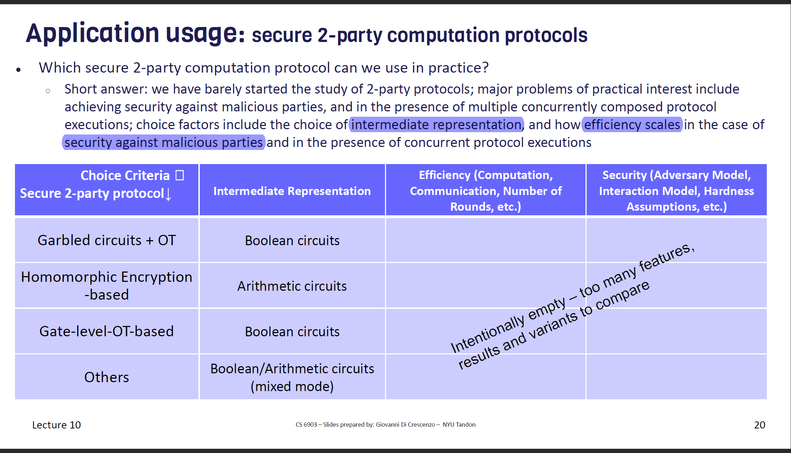
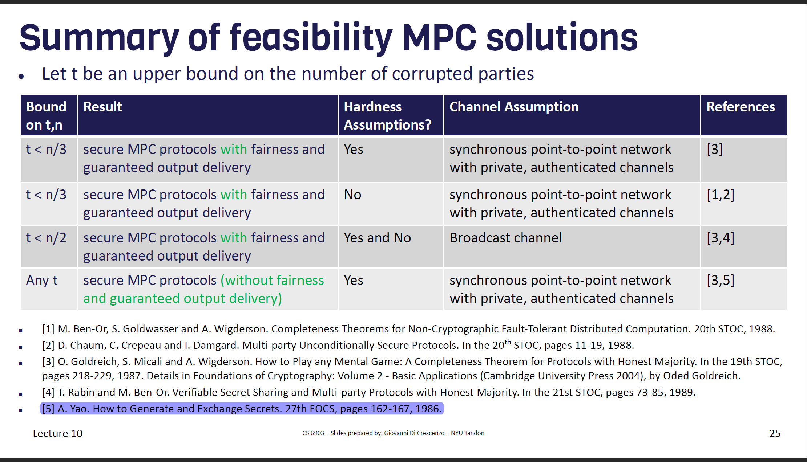

# Prologue
- Secure 2-Party Computation
- Secure Multi-Party Computation

# Secure 2-Party Computation

## Problem(informal)
A and B want to perform a fucntion f on their data. And they don't want others to know their data.

## Types of Solution
- General-purpose, e.g. Hash
- Special-purpose, e.g. FHE

## Solutions
Most general-purpose solutions are based on 
- Full Homomorphic Encryption
- Circuit Based Solutions

# Predicate-Revealing Symmetric Encryption

Equality-revealing and Order-revealing

> Predicate-revealing symmetric encryption, a type of symmetric encryption where a certain predicate of encrypted plaintext(s) is revealed (even without the key)

# Yao's Solution
GC + OT

If you want to know more about Yao's solution, just have a try to implement it:)

[Mine implementation](https://github.com/n132/SMC)

This project also includes implementation of 2-Party GMW (X-Version). 

# Secure Multi-Party Computation

## Problem(informal)
n parties have inputs $\{X_1,...X_n\}$, They want to perform fcuntion f over their inputs without leaking their inputs.

## Application

* Double auction
* Statistics about compensation
* Advertising conversion
* MPC for cryptographic key protection
* Government collaboration
* Privacy-preserving analytics

## Solutions

