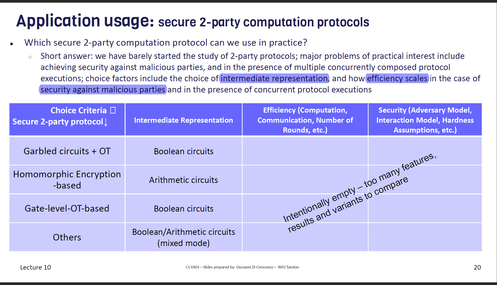
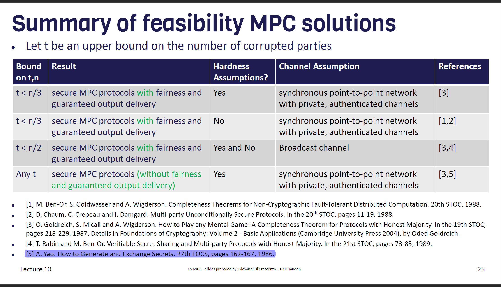

# Prologue

- Secure 2-Party Computation
- Secure Multi-Party Computation

# Secure 2-Party Computation

## Problem(informal)
A and B want to perform a fucntion f on their data. And they don't want others to know their data.

## Types of Solution
- General-purpose, e.g. Hash
- Special-purpose, e.g. FHE

## Solutions
Most general-purpose solutions are based on 
- Full Homomorphic Encryption
- Circuit Based Solutions

# Predicate-Revealing Symmetric Encryption

Equality-revealing and Order-revealing

> Predicate-revealing symmetric encryption, a type of symmetric encryption where a certain predicate of encrypted plaintext(s) is revealed (even without the key)

# Yao's Solution
GC + OT

If you want to know more about Yao's solution, just have a try to implement it:)

[Mine implementation](https://github.com/n132/SMC)

This project also includes implementation of 2-Party GMW (X-Version). 

# Secure Multi-Party Computation

## Problem(informal)
n parties have inputs $\{X_1,...X_n\}$, They want to perform fcuntion f over their inputs without leaking their inputs.

## Application

* Double auction
* Statistics about compensation
* Advertising conversion
* MPC for cryptographic key protection
* Government collaboration
* Privacy-preserving analytics

## Solutions

# Secret Sharing

Informal Definition:

n parties want to share a secret and only a subset of these n parties could recover it.

## Constructions

we have `n` parties and we need `t+1` parties to recover the secret `s`.

* t=0
  * Everyone's share is `s`
* t=n-1
  * generate `n-1` random numbers $\{r_1,r_2,...,r_{n-1}\}$
  * the last share = $r_1 \oplus r_2 \oplus ... r_{n-1}\oplus s$
* n-1>t>0
  * Shamir's Schem
  * only T+1 shares could confirm a unique T-degree polynomial

# BGW Protocol

- I don't understand the details and don't want to understand!

# Circuit Compilers

That's a interesting topic, it tries to convert original representation algorithm to an intermediate representation. (Boolean circuit)

This part is an unfinished part of my SMC project. If I have enough time, I want to have a try!

More info: https://marsella.github.io/static/mpcsok.pdf