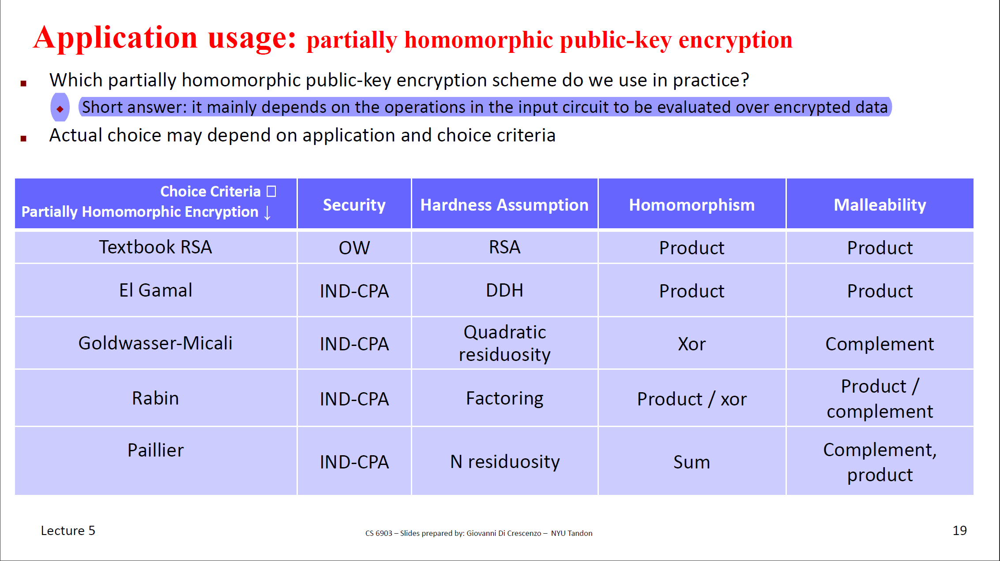
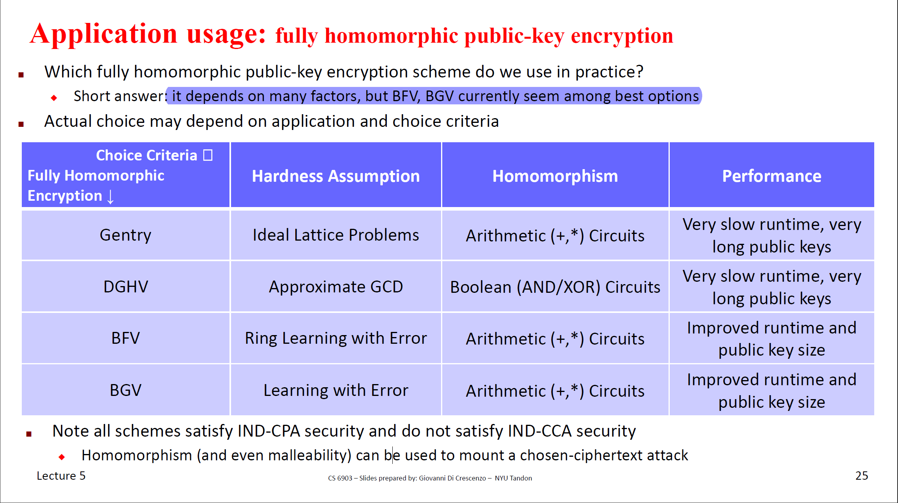

# Prologue

The end of Public Key Encryption

Computing over Encrypted Data

# Hybrid Encryption
runtime efficiency + reduced interaction  == Private-Key Encryption+ Public-Key Encryption

## Scheme
aES means asymmetric encryption and sES means symmetric encryption

---
$aES=((aKG,aE,aD),sES=(sKG,sE,sD)$

KG: $aKG\rightarrow(PK,SK)$

E: $(c1,c2): randomGen()\rightarrow k, c1=aE(PK,k), c2=sE(k,m)$

D: $k=aD(SK,c1),m'=sD(k,c2)$

---

## Security

> If aES satisfies IND-CPA-security and sES satisfies IND-security then ES satisfies IND-CPA-security

> if aES satisfies IND-CCA-security and sES is IND-CCA-security then ES satisfies IND-CCA-security

## Practical Key Encapsulation
Faster key encapsulation, easy to understand if you know El-Gamal and RSA.
- Key encapsulation from DDH/CDH
- Key encapsulation from RSA

## What scheme do we use in practice?
IND-CCA-Secre RSA KEM + IND-CCA-Secre Private-Key Encryption Scheme

# Homomorphic Encryption
Definition(informal):

`E(pk, m1 ) ○ E(pk, m2 ) = E(pk, m1 + m2)`

For example,  El-Gamal is product-homomorphic.

$C_1 = (g^r,h^r*m_1)，C_2 = (g^s,h^s*m_2)$

We could get the encryption of $m_1*m_2$:

$C=(g^{r+s},h^{r+s}*m_1*m_2)$

Some tips I found are intereting:

- It's similar to MPC. If people want to decrypt `C` they need `r` and `s`(SK from two party)
- The key pair of `C` could be different from the key pairs of `C1` and `C2`
- Moreover, the key pairs of `C1` and `C2` could be diffrent, too.

# Malleable Encryption

Definition(informal):

$f_C(E(pk, m)) = E(pk, f_M(m))$

* $f_C$ means a function works on Ciphertext
* $f_M$ means a function works on Message

For example, El-gamal is product maleable. (The "product" means the function applied to the plaintext/message).

$C=(g^r,h^r*m)$

Applt `*t` to the ciphertext:
$C'=(g^r,h^r*m*t)$

Decrypt `C'`, we could get `m*t`.

- In this case, $f_C,f_M$ are the same. They could be different.

Q: Is homomorphisms more powerful than malleableness (AKA could we find malleableness in all Homomorphic Encryptions)?

My answer is Yes

Proof:

If we have a public-key encryption scheme satisfies `E(pk, m1 ) ○ E(pk, m2 ) = E(pk, m1 + m2)`

For a known `m1` we could get  `E(pk, m1 )` easily

So this encryption is `((M,f),(C,g))-malleable`
where $f_m(x) = x + m_1, f_c(x)= x\quad o\quad E(pk, m_1 )$

# Additional Public-Key Encryption Schemes
In this section, the professor introduces lots of PKE schemes. I don't understand every scheme in depth but know the properties of them.

## Goldwasser-Micali Encryption
* Hard Problem/Assumption: Based on `quadratic residue`
* Message space `{0,1}`
* IND-CPA-Secure
* xor-homomorphic
* complement-malleable

## Rabin Encryption
Tips: Rabin came up with OT
* Hard Problem/Assumption: Based on computing the square root mod n
* product-homomorphic and product-malleable
* IND-CPA-Secure

## Paillier Encryption
* Hard Problem/Assumption: Based on distinguishing whether a number y in Zx* is an n-th residue mod n2
* IND-CPA-Secure
* sum-homomorphic
* (sum by a known value)-malleable
* (multiplication by a known value)-malleable

# FHE Full Homomorphic Encryption
A `fully-homomorphic encryption` scheme is a public-key cryptosystem that is **both** sum-homomorphic and product-homomorphic.

> Tips: Any polynomial-time computation can be expressed in terms
of such arithmetic circuits(+,*).
> A known result from complexity theory says that any polynomial-time computation can be expressed in terms of Boolean circuits (i.e., with circuit gates being a XOR or an AND)

## Gentry Encryption
* Make FHE possible by "A somewhat homomorphic" + "boostrapping" 
* use ideal lattices
* theoretically efficient, but is too inefficient to be used in practice (too large keys + ciphertexts)
* Arithmetic (+,*) Circuits

## DGHV Encryption

- A somewhat homomorphic scheme + bootstrapping
- IND-CPA-security is proved assuming the hardness of an approximate integer greatest common divisor
- Boolean (AND/XOR) Circuits

# Misc
Some topic not mentioned
- The Random Oracle Methodology
