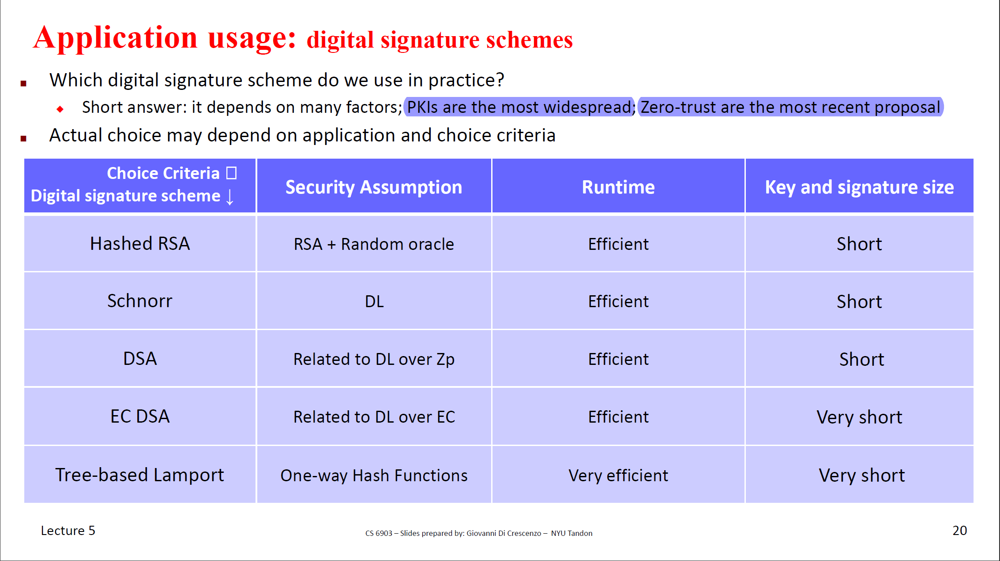

# Prologue
- Digital Signature
  - Text Book RSA
  - Hashed RSA
  - Schnorr's Scheme
  - El-Gamal Scheme
  - Lamport's Scheme
- Trust Models
  - PKI
  - Identity-based Encryption

# Digital Signature Intro
secure `Data integrity` and `Authenticity`

## Digital Signature vs MACs
MACs:
- A and B share a random key
- Triple $(Gen,Tag,Vrfy)$

Digital Signature
- Use SK to sign and PK to verify
- Triple $(KG,Sign,Vrfy)$
- Publicly Verifiable
- Signer can't deny
- Transferable

## Security

Extentially Unforgeable under CPA
- Informal Version: A could ask the victim to sign and A forge a sign for a message which the victim did not sign.

Universal Forgeable
- There is an effient algorithm to forge signature for all the messages

# Text Book RSA

## Scheme

- KG: (p and q are big same-length prime)
  - $n= p*q, ed = 1 mod\quad phi(n)$
  - $PK\rightarrow(e,n), SK\rightarrow(d,n)$ 

- $Sign\leftarrow s=m^dmod\quad n$
- $Vrfy\leftarrow m=s^emod\quad n$ 

## Security
Inseure

Existential Unforgeability without CPA

$s=Sign(m),m=s^e$

Universal Forgeable with CPA

Query random $m_1,m_2$ to get  $S_1,S_2$

$Sign(m_1*m_2)=S_1*S_2$

# Hashed RSA
## Scheme

- KG: (p and q are big same-length prime)
  - $n= p*q, ed = 1 mod\quad phi(n)$
  - $PK\rightarrow(e,n), SK\rightarrow(d,n)$ 
- $Sign\leftarrow s=H(m)^dmod\quad n$
- $Vrfy\leftarrow H(m)=s^emod\quad n$ 

## Security

Existentially Unforgeable under CPA

# Schnorr's Signature Scheme
## Scheme 

- Schnorr's Identification Scheme

Bob is verifying Alice's ID. Alice's PK is (G,g,y),$y=g^x$
1. Alice sends $z=g^k$,k is a random number
2. Bob send random number `c` back to Alice
3. Alice send $w = k+cx\quad mod\quad q$ to Bob
4. Bob verify if $g^w==z*y^c$

- Fiat-Shamir transform

## Security
- If DL is hard, Schnorr’s protocol is an identification scheme secure against passive attacks (eavesdropping)
- If H is a random oracle, applying Fiat-Shamir transform to an id scheme secure against
passive attacks results in an unforgeable signature scheme in the presence of chosen message attacks
- This scheme is existentially unforgeable secure

# El-Gamal Signature Scheme
* KG
  * $PK=(p,g,y)$,p is a prime, g is the generator, and $y=g^x$
  * $SK=x$
* Sign = $(r,s)$
  * $r=g^k$,k is a random coprime of p-1
  * $s=(H(m)-x*r)*k^{-1}$ mod $(p1)$
* Vrfy
  * $g^{H(m)}=y^r*r^s$

Correctness:

$y^rr^s=g^{xr}g^{ks}=g^{x*r+k*s}$ and $s*k=(H(m)-x*r)$
$\rightarrow y^rr^s=g^{H(m)}$

- This scheme is existentially unforgeable secure

## DSA Signature Scheme
- Variant by NIST of the El Gamal signature scheme
- No known attacks
- EC+DSA = ECDSA

# Lamport’s scheme

## 1-bit 
- One-time Signature (Existentially unforgeable under a 1-query)
- KG
  - $y(b) = H(x(b)),b \in \{0,1\}$
- Sign
  - Message|Signature = $m|x(m)$
- Vrfy
  - check if y(m) = H(S)
## n-bit
- one time signature for n-bit
- key length is linear in message length
- Could use hash-and-sign to get a fixed length signature

## sign t messages
- Chain-based scheme
- Tree-based scheme

# Trust Models

- Based on a key
- Based on a third authority

## PKI
We can't link the public key to people's names. We need a trusted authority(Certification Authority).

1. What's a certificate cert?

Certificate cert=`sign(PKCA,SKCA,(Bob’s ID, PKBob, duration, etc))`

2. What's CRL and OCSP?

Certificate revocation list and Online Certificate Status Protocol.

CRL documents revoked certificates(expired certs are not in CRL); People could ask OCSP server to get the status of a cert.

## Identity-Based Encryption

People can use any binary id string as a public key,
including his name, e-mail address, a
timestamp, concatenation of those, etc

# Topic not included
- ECC